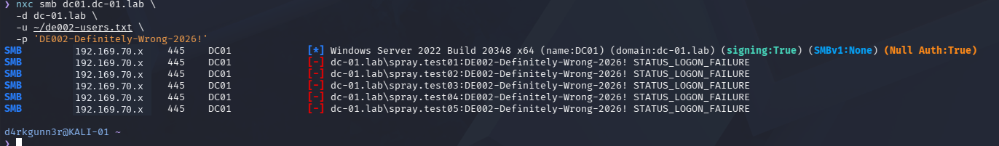
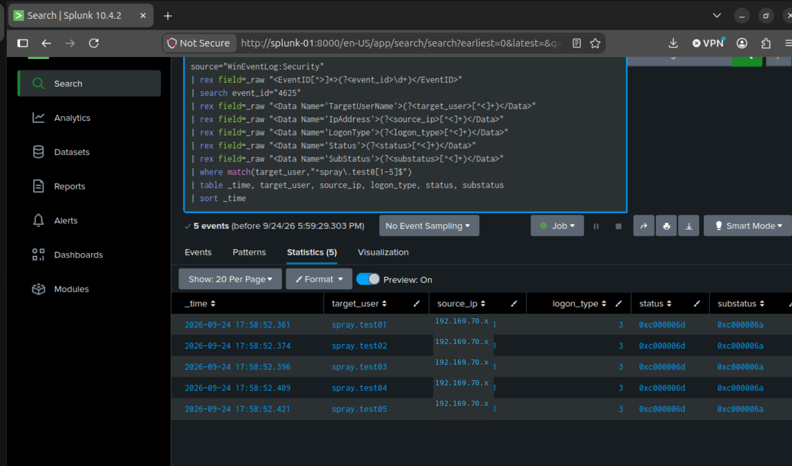
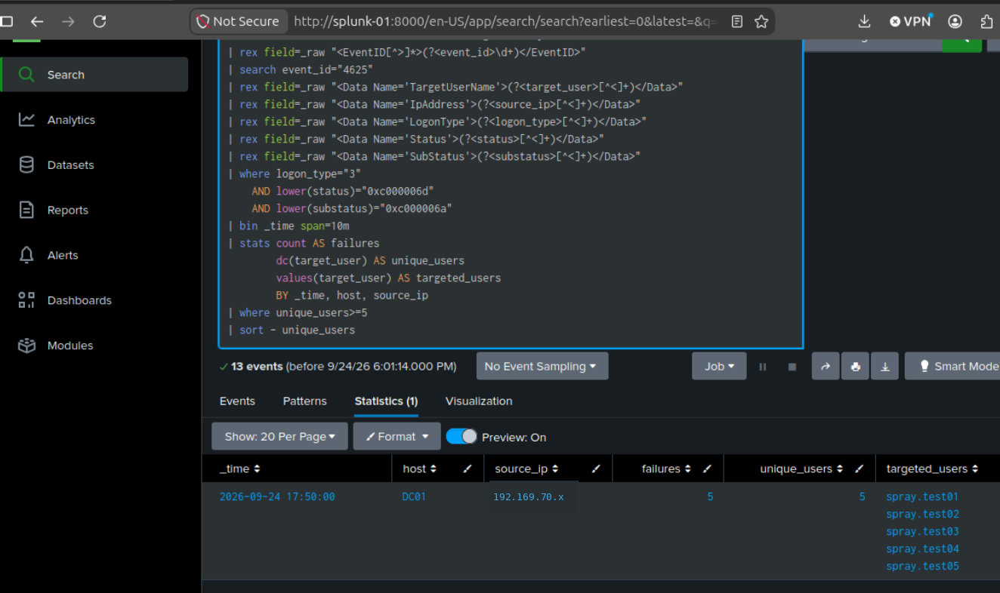

# DE-002 — Detecting Active Directory Password Spraying

**Case type:** Detection Engineering / Controlled Authentication Investigation  
**Date:** September 24, 2026  
**Environment:** Isolated Active Directory SOC lab · Kali · DC01 · Splunk Enterprise 10.4.2  
**Result:** **Validated against five captured failed network logons**  
**Rule status:** Sigma CLI validation and Splunk backend conversion passed; saved production-style alert **not yet verified**.

> **Evidence handling:** Public examples use `192.169.70.x` as a documentation-only placeholder, **not** an operational IP address. Upload only sanitized screenshots. The three image paths below are reserved for the sanitized evidence package.

## 1. Executive summary

A controlled password-spraying simulation was conducted from a Kali workstation against five **disposable**, non-privileged Active Directory test accounts on DC01. One intentionally incorrect password was submitted against each account via NetExec over SMB. The Kali console displayed five `STATUS_LOGON_FAILURE` responses. Splunk subsequently displayed **five matching Windows Security Event ID 4625 events**, all associated with one source and five distinct target accounts. A ten-minute correlation query returned **one detection group** with five failures and five unique users.

The captured behavior matches a deliberately rapid **password-spraying simulation**, not evidence of an unauthorized intrusion. The five-account threshold is a lab validation setting, not a production-tuned threshold.

| Finding | Observed result |
|---|---|
| Target host | `DC01` |
| Origin | `KALI-01` (address redacted) |
| Targeted accounts | `spray.test01` through `spray.test05` |
| Authentication | SMB / NTLM |
| Windows event | `4625` |
| Logon type | `3` — network |
| Status / SubStatus | `0xC000006D` / `0xC000006A` |
| Matching events | **5** |
| Unique targeted accounts | **5** |
| Detection window | September 24, 2026, 17:50–18:00 as displayed by Splunk |
| Result | **Threshold met** |

## 2. Scope and authorization

The experiment was restricted to the isolated home lab and five accounts created expressly for DE-002. No real employee accounts, service principals, or third-party systems were targeted. Domain controller Security events were forwarded to Splunk's `windows` index.

The broader BadBlood directory population was **not** used as the target list after group-membership checks exposed potentially administrative memberships.

## 3. Timeline and chain of evidence

| Time (Splunk display) | Activity | Evidence |
|---|---|---|
| Before 17:58 | Baseline search for recent failed logons | Previous baseline showed one unrelated local Administrator failure; the five disposable users had no matching baseline shown |
| 17:58:52.361–17:58:52.421 | Five failed NTLM network logons recorded for five different test accounts | Windows Security 4625 table |
| 17:50–18:00 window | Ten-minute aggregate matched one source with five failures against five distinct users | Splunk correlation result |

The event timestamps span approximately **60 milliseconds** in the supplied Splunk result. This documents the laboratory's rapid simulation; real password spraying may be slower or distributed.

## 4. Attack simulation and observed output

The Kali test used a username file containing only the five disposable accounts and a single intentionally invalid password. NetExec reported `STATUS_LOGON_FAILURE` for each account.



**Analyst observation:** The console confirms the authentication attempts were rejected. It does not alone establish the corresponding Windows event count; the Splunk evidence below provides that correlation.

## 5. Host telemetry and event analysis

Splunk showed exactly five matching `4625` records for the designated test accounts. All five share a source address (redacted in published evidence), logon type `3`, `Status=0xC000006D`, and `SubStatus=0xC000006A`. The distinct user field is the main difference from **DE-001**, where one account was targeted repeatedly.



| Field | Interpretation |
|---|---|
| `TargetUserName` | Five distinct targeted test identities |
| `IpAddress` | One common source, redacted publicly |
| `LogonType=3` | Network authentication |
| `Status=0xC000006D` | Failed logon |
| `SubStatus=0xC000006A` | Incorrect password |

**Collection detail:** The Universal Forwarder sent XML-formatted Windows Security events; SPL `rex` extraction from `_raw` was used instead of assuming an automatically normalized `EventCode` field.

## 6. Detection development and validation

The validated correlation groups incorrect-password network-logon events by **source address and ten-minute bucket**, counting both failures and **distinct** target usernames. A source qualifies for the lab alert when it reaches at least five different accounts in one bucket.



### Validated Splunk SPL

[Standalone SPL query](../../detections/spl/DE-002-ad-password-spraying.spl)

```spl
index=windows host=DC01 source="WinEventLog:Security"
| rex field=_raw "<EventID[^>]*>(?<event_id>\d+)</EventID>"
| search event_id="4625"
| rex field=_raw "<Data Name='TargetUserName'>(?<target_user>[^<]+)</Data>"
| rex field=_raw "<Data Name='IpAddress'>(?<source_ip>[^<]+)</Data>"
| rex field=_raw "<Data Name='LogonType'>(?<logon_type>[^<]+)</Data>"
| rex field=_raw "<Data Name='Status'>(?<status>[^<]+)</Data>"
| rex field=_raw "<Data Name='SubStatus'>(?<substatus>[^<]+)</Data>"
| where logon_type="3"
    AND lower(status)="0xc000006d"
    AND lower(substatus)="0xc000006a"
| bin _time span=10m
| stats count AS failures
        dc(target_user) AS unique_users
        values(target_user) AS targeted_users
        BY _time, host, source_ip
| where unique_users>=5
| sort - unique_users
```

**Verified result:** The supplied search examined 13 candidate events and returned **one aggregated row**: five failures, five distinct users, one originating source, and a 17:50 ten-minute bucket. The 13 candidate events are **not** all part of the detected spray.

### Sigma event-selection rule

[DE-002 Sigma rule](../../detections/sigma/DE-002-ad-password-spraying.yml) selects the individual failed network-logon events (Windows 4625, logon type 3, incorrect-password status/substatus). The user's Kali CLI showed **zero validation issues** and successfully converted the Sigma rule using the `splunk_windows` processing pipeline. The Sigma event rule itself does **not** encode the five-account correlation; the SPL query above implements the threshold.

### ATT&CK mapping

**T1110.003 — Password Spraying**, as the behavior modeled by the authorized simulation. The mapping does not establish that an external attacker was present.

## 7. Findings, limitations and false positives

**Finding:** Five test accounts received incorrect-password network-logon attempts from a common lab source over approximately 60 milliseconds, and the correlation query returned the intended detection.

**Limitations:** This validation covers a fast SMB/NTLM exercise using disposable accounts and one domain controller. Fixed ten-minute buckets can split behavior crossing bucket boundaries. The source address can be absent or misleading in some event contexts. A production rule should account for distributed and low-and-slow attempts and confirm indexing/field extraction across relevant domain controllers. Scheduled alert delivery has **not** been verified.

**Potential benign explanations for similar telemetry:** shared-host misconfiguration, stale credentials, scheduled tasks, service-password rotation issues, vulnerability scanning and sanctioned security exercises. Do not equate a threshold match with a confirmed compromise.

## 8. Analyst response playbook

1. Confirm the underlying `4625` records, time window, source, accounts and failure codes.
2. Determine whether the source is an expected scanner, jump host, application or unknown endpoint.
3. Check for matching successful authentications (Windows `4624`) after the failures.
4. Examine additional domain-controller authentication events (for example, `4776` for NTLM validation) when collected.
5. Check whether the same source targeted more users across additional hosts or time windows.
6. Escalate suspicious activity for endpoint triage, account protections and credential resets according to the environment's incident procedures.
7. Tune thresholds only after measuring baseline traffic and documenting known-good sources.

## 9. Outcome and next validation

**Validated:** Controlled five-account simulation → DC01 Windows 4625 collection → XML field extraction → five-account Splunk correlation → Sigma CLI check and conversion.

**Not yet demonstrated:** Production alert scheduling, automated notification, Sentinel ingestion or KQL parity. Those require separate tests.

For publication, review the [evidence package](screenshots/) to ensure screenshots are sanitized before public upload.
