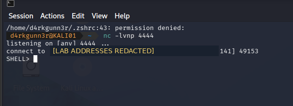
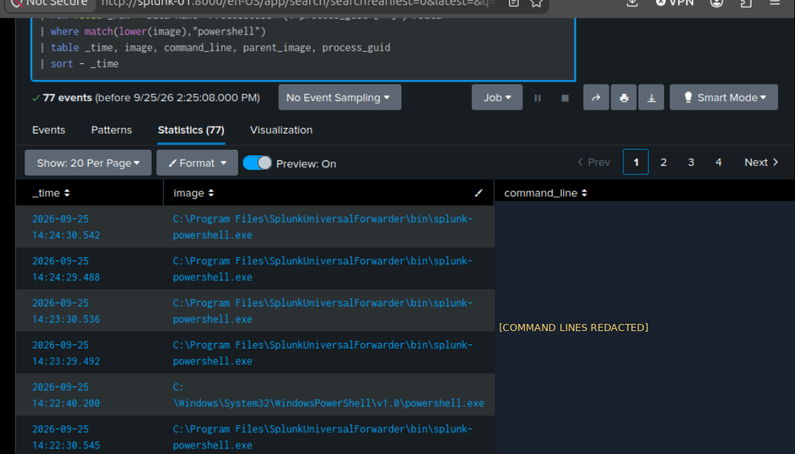
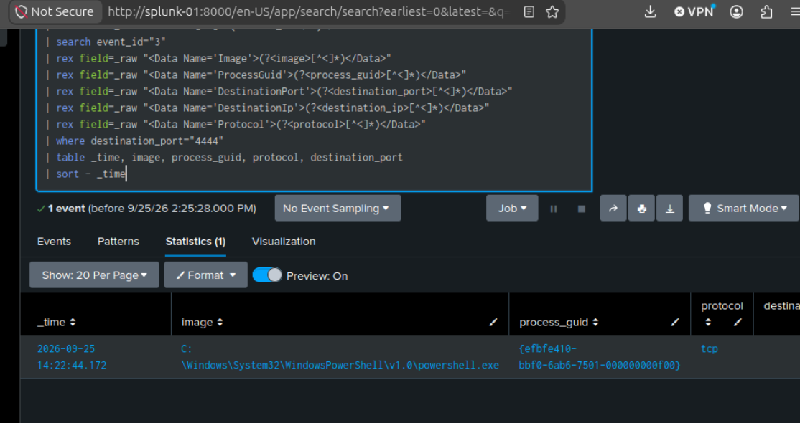
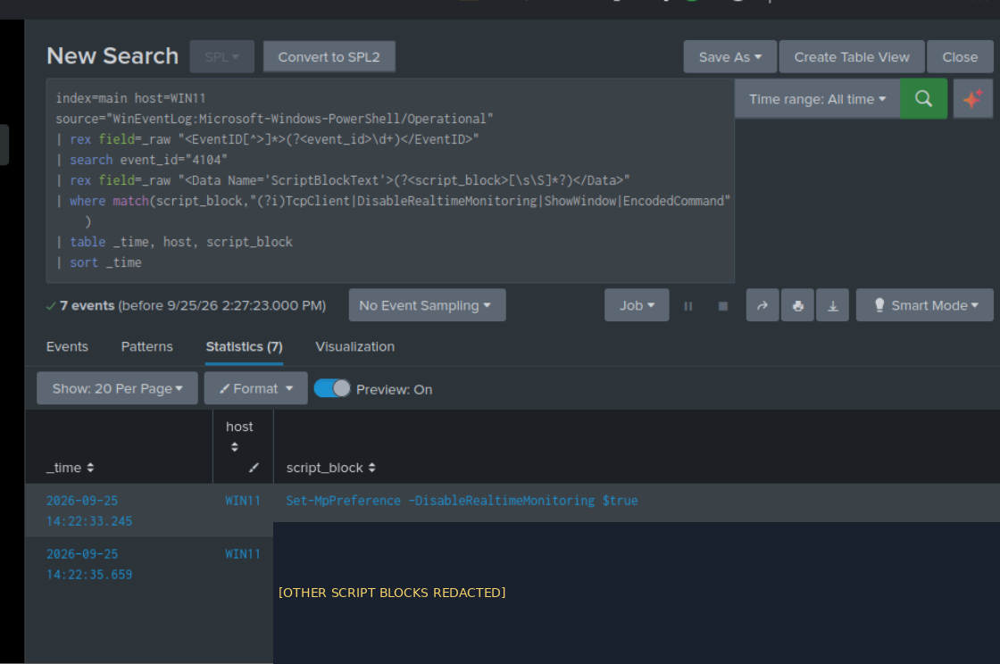
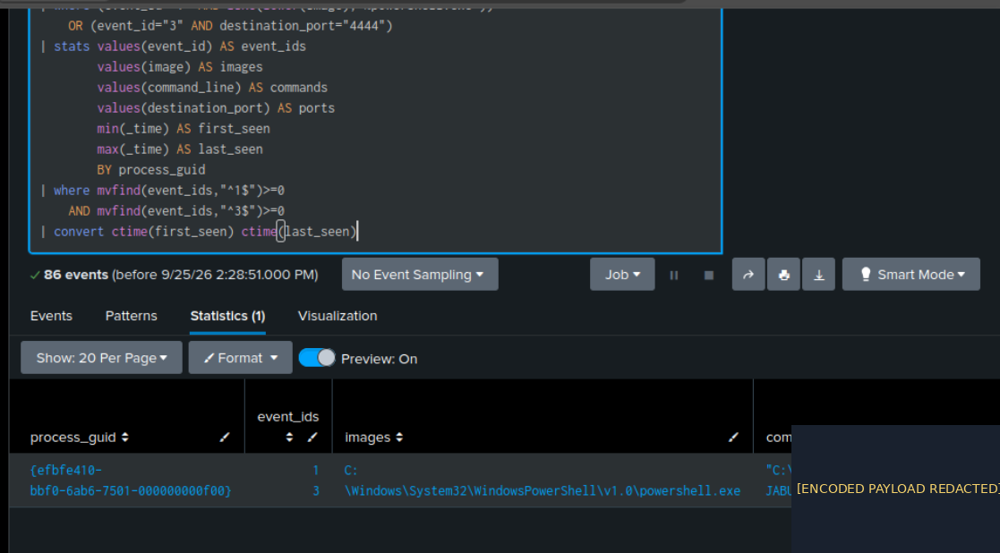

# DE-003 — BadUSB-Initiated PowerShell Execution and Network Callback

> **Case type:** Detection Engineering / Controlled Endpoint Investigation  
> **Date:** September 25, 2026  
> **Environment:** Flipper Zero BadUSB; disposable Windows 11 VM (`WIN11`); Kali listener; Splunk Enterprise  
> **Evidence status:** PowerShell execution, TCP connection, script blocks and shared process GUID **observed**. The expanded candidate detection and scheduled alert **still require testing**.  
> **Publication note:** Screenshots have been prepared with sensitive addresses and payload regions obscured. Image links below will become visible once the five approved PNGs are uploaded. Do not publish original unredacted captures.

## 1. Executive summary

This case study reconstructs a controlled laboratory exercise involving a Flipper Zero BadUSB script that initiated PowerShell activity on a Windows 11 VM. A Kali Netcat listener received an inbound TCP session and displayed a `SHELL>` prompt. Splunk ingested Sysmon and Windows PowerShell events from WIN11.

A Sysmon **Event ID 1** showed PowerShell with an encoded-command argument, and **Event ID 3** showed a PowerShell outbound TCP connection to destination port **4444**. A follow-up Splunk search matched **the same Sysmon `ProcessGuid`** across both records. PowerShell **Event ID 4104** recorded an attempt to run `Set-MpPreference -DisableRealtimeMonitoring $true`. This establishes an attempted security-setting change, **not** proof that protection was disabled. The operator subsequently reported protection restored, without a separate status capture.

The Flipper as the initiating input device is supported by the operator's supplied script and exercise description, not by independent USB-attach forensic telemetry. This is an **authorized lab simulation**, not an external compromise.

## 2. Objective and authorized scope

**Question:** Can an analyst link encoded PowerShell execution, an outbound network connection, and a defense-configuration modification attempt using Windows endpoint telemetry?

**In scope:** Isolated WIN11 VM, Flipper Zero BadUSB test, Kali listener and Splunk's WIN11 Sysmon/PowerShell telemetry. **Not tested:** persistence, credential theft, lateral movement, exfiltration, or proof of Defender disablement.

```text
Flipper BadUSB (operator-supplied execution script)
      |
      v
WIN11 / powershell.exe
      |--- Sysmon 1: encoded-command process creation
      |--- PowerShell 4104: Defender-setting modification attempt
      |--- Sysmon 3: outbound TCP 4444
      |
      v
Kali listener: incoming session / SHELL> prompt
      |
      v
Splunk: Sysmon ProcessGuid correlation
```

## 3. Walkthrough: investigation and evidence

### 3.1 Confirm listener-side activity

The operator ran a Kali Netcat listener and observed an inbound TCP connection followed by the `SHELL>` prompt. This confirms a connection and prompt; the screenshots do **not** demonstrate successful execution of arbitrary remote shell commands.



### 3.2 Investigate encoded PowerShell execution

Search `index=main`, `host=WIN11` and source `WinEventLog:Microsoft-Windows-Sysmon/Operational` for **Event ID 1**. Extract `Image`, `CommandLine`, `ParentImage` and `ProcessGuid` from XML-formatted `_raw`. The supplied search showed encoded PowerShell near **14:22:40** local Splunk display time.

**Triage caveat:** The raw process search also returned Splunk's legitimate `splunk-powershell.exe` helper. Select the actual Windows `powershell.exe` image rather than treating all filenames containing “powershell” as malicious.



### 3.3 Correlate the outbound connection

Search Sysmon **Event ID 3** for `DestinationPort=4444`. The screenshot showed a `powershell.exe` connection around **14:22:44**. The address is intentionally omitted from public text and images.



### 3.4 Inspect script block telemetry

The WIN11 PowerShell Operational source showed **Event ID 4104** around the activity. One script block recorded the command `Set-MpPreference -DisableRealtimeMonitoring $true` at approximately **14:22:33**. This is **evidence of an attempt**, not verification of Defender's resulting state.



### 3.5 Link process and connection by GUID

A corrected Splunk correlation search grouped Sysmon 1 and 3 events by `ProcessGuid`, returning a shared identifier for PowerShell creation and the connection to port 4444. This is stronger than attribution based on timestamp proximity alone.



## 4. Timeline and evidence register

| Local Splunk display | Artifact | Supported observation |
|---|---|---|
| 14:22:33 | PowerShell 4104 | Defender modification command recorded |
| ~14:22:40 | Sysmon 1 | Encoded-command PowerShell process |
| ~14:22:44 | Sysmon 3 | PowerShell outbound TCP 4444 connection |
| Follow-up hunt | Splunk `stats` grouped by `ProcessGuid` | Event IDs 1 and 3 associated with one process |
| Listener screenshot | Kali terminal | Inbound session and `SHELL>` prompt |

The screenshots show local Splunk display times. Preserve original event UTC times in any later cross-host forensic timeline.

## 5. SPL hunt and candidate correlation detection

The **original process-GUID investigation** was executed and returned the common process. The [expanded SPL candidate](../../detections/spl/DE-003-encoded-powershell-network-correlation.spl) additionally requires an encoded-command argument and that the outbound connection occur within **120 seconds** of process creation. It uses TCP 4444 **only as a lab validation indicator**.

**Validation required before marking the expanded rule complete:** Replay the original test window, inspect the returned process GUID and event times, then test the saved alert separately. For operational deployment, generalize the port, measure benign encoded PowerShell usage and tune by process ancestry and destination context.

The [Sigma rule](../../detections/sigma/DE-003-encoded-powershell.yml) detects individual encoded-command PowerShell process-creation events. It **does not** implement Sysmon 1/3 correlation. Its YAML schema validation and backend conversion are also **not yet verified**.

## 6. Analyst assessment and limitations

**Established:** An encoded PowerShell process was observed, a PowerShell TCP 4444 connection was logged, both events shared a process GUID, a related 4104 record captured a Defender modification attempt, and the listener displayed a remote prompt.

**Not independently established:** Exact physical USB-keyboard source; interactive command execution after the prompt; successful defense impairment; persistence; exfiltration; expanded detection performance; alert notification delivery.

**False-positive considerations:** Legitimate encoded PowerShell in administration and installers; Splunk's helper process; authorized testing; software that uses short-lived outbound TCP sessions. A single encoded command or unusual port is not sufficient to conclude malicious activity.

**ATT&CK context:** T1059.001 PowerShell; T1562.001 Impair Defenses (attempted). These are descriptive mappings to the simulated behavior.

## 7. Response playbook

1. Preserve raw XML for Sysmon 1 and 3, PowerShell 4104 and accurate UTC timestamps.
2. Collect process image, original command line, parent process, user session and process GUID.
3. Link network connections to the exact process GUID, destination, DNS and any proxy/flow telemetry.
4. Check Microsoft Defender Operational telemetry and effective protection state; distinguish attempted from successful tampering.
5. Review other endpoints for the same executable flags and correlated connections.
6. Decide on containment and credential measures based on source ownership, corroboration and organizational response procedures.

## 8. Lessons learned and next steps

- The `ProcessGuid` correlation independently links process creation to outbound network activity.
- Script Block Logging exposes an attempted Defender change but does not establish its effect.
- XML field extraction and exact image-name filtering prevent avoidable false-positive attribution.
- The expanded SPL rule, Sigma schema conversion and scheduled alert remain **pending separate validation**.

**Evidence publication:** Use the five prepared **redacted** screenshot files only. Never publish the full encoded reverse-shell payload, credentials or real lab IP addresses. `192.169.70.x` is a documentation-only placeholder, not a working subnet.
