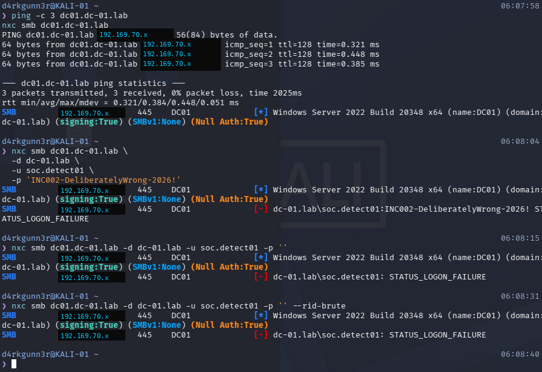
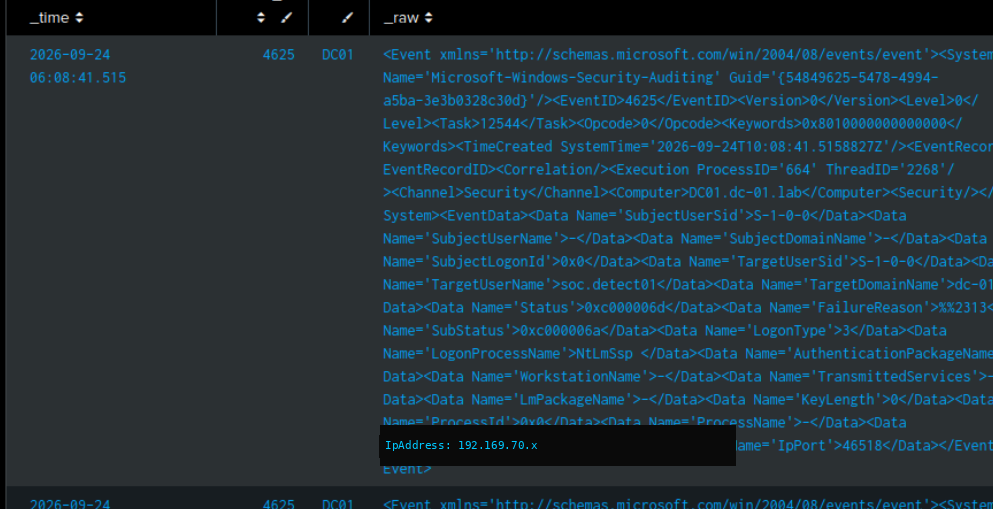
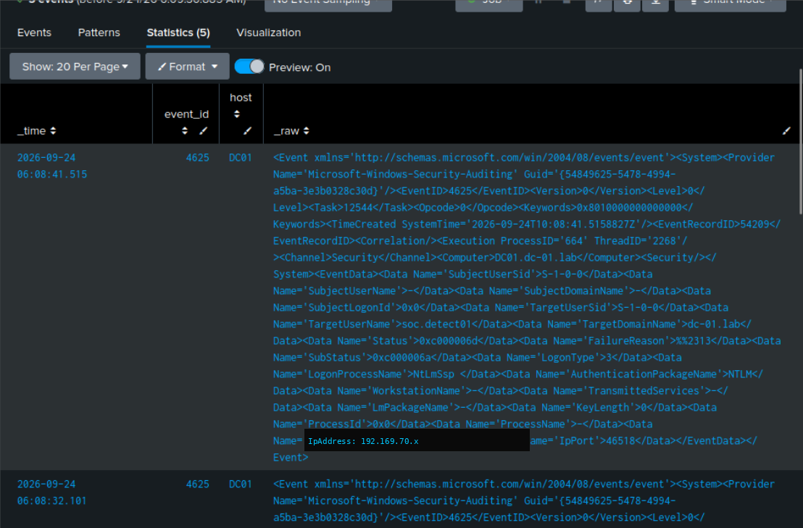
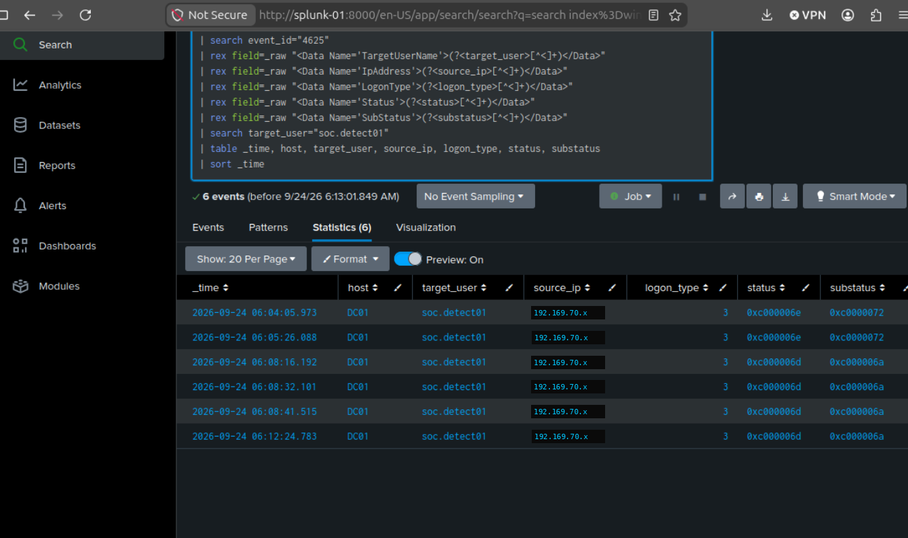
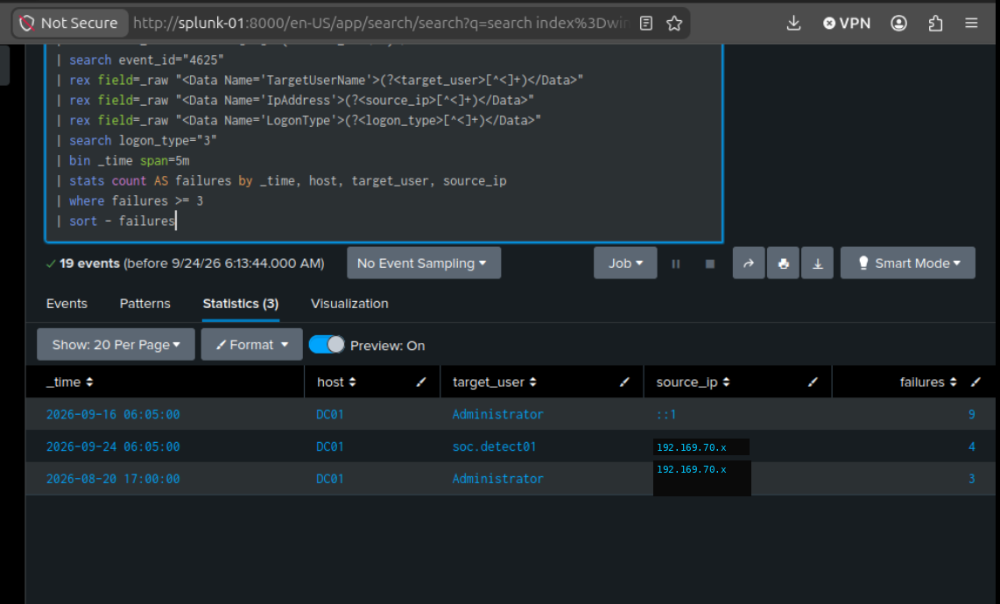
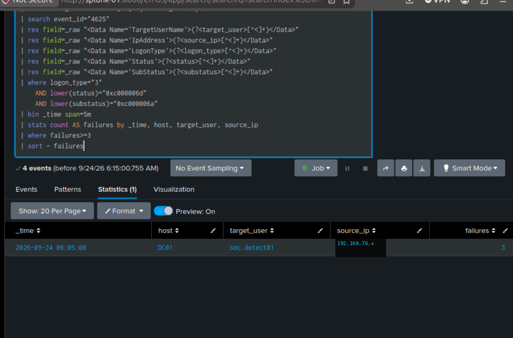

# INC-002 — Active Directory Authentication Investigation

> **Report type:** Detection Engineering / Incident Response Case Study  
> **Environment:** Isolated SOC home lab  
> **Primary data source:** Windows Security logs from `DC01` ingested into Splunk  
> **Status:** Detection validated  
> **Sensitivity note:** Public screenshots and examples use `192.169.70.x` as a documentation placeholder. It is not the operational lab addressing scheme.

---

## 1. Executive Summary

This report documents a controlled authentication-failure investigation against an Active Directory domain controller. Kali generated SMB authentication failures against a disposable domain account, `soc.detect01`, using NetExec. `DC01` recorded Windows Security Event ID `4625`, and Splunk identified repeated incorrect-password network logons from the same source within a five-minute window.

The validated detection identifies probable brute-force-style authentication behavior where Windows logs show:

| Field | Detection Value |
|---|---|
| Event ID | `4625` |
| Logon type | `3` — Network logon |
| Status | `0xC000006D` — Logon failure |
| SubStatus | `0xC000006A` — Incorrect password |
| Threshold | `>= 3` failures in `5m` by `source_ip` and `target_user` |

**Outcome:** The lab successfully demonstrated an end-to-end detection workflow: attack simulation, event collection, field extraction, SPL detection logic, and Sigma rule creation.

---

## 2. Scope and Authorization

This activity was conducted in an isolated lab for authorized detection engineering practice. The test used a disposable Active Directory account and intentionally limited authentication attempts. No third-party systems were targeted.

| Component | Description |
|---|---|
| Domain controller | `DC01` |
| Attacker system | `KALI-01` |
| SIEM | `SPLUNK-01` |
| Test account | `soc.detect01` |
| Technique exercised | Repeated failed SMB authentication |

---

## 3. Timeline of Activity

| Time | Event |
|---|---|
| 06:07 | Kali verified connectivity to the domain controller. |
| 06:08 | NetExec SMB authentication attempts returned `STATUS_LOGON_FAILURE`. |
| 06:08 | `DC01` generated Windows Security Event ID `4625`. |
| 06:13 | Splunk field extraction confirmed failed-logon fields. |
| 06:15 | Refined SPL detection identified three incorrect-password failures in a five-minute window. |

---

## 4. Attack Simulation Evidence

Kali verified reachability to `DC01` and used NetExec to attempt SMB authentication against `soc.detect01` with an intentionally incorrect password.



**Observed result:** NetExec returned `STATUS_LOGON_FAILURE`, confirming the authentication attempts reached the domain controller and were rejected.

---

## 5. Host and Log Evidence

Splunk captured Windows Security Event ID `4625` from `DC01`. The event showed a failed network logon using NTLM.





### Key Event Fields

| Field | Value | Interpretation |
|---|---|---|
| `EventID` | `4625` | Failed logon |
| `TargetUserName` | `soc.detect01` | Targeted disposable account |
| `LogonType` | `3` | Network logon |
| `LogonProcessName` | `NtLmSsp` | NTLM logon process |
| `AuthenticationPackageName` | `NTLM` | Authentication package |
| `Status` | `0xC000006D` | Logon failure |
| `SubStatus` | `0xC000006A` | Incorrect password |

Earlier account-setup failures produced `SubStatus = 0xC0000072`, meaning the account was disabled. Those events were treated as setup noise and excluded from the final detection.

---

## 6. Analysis

Because the Windows events were ingested as XML, Splunk did not rely on default normalized fields. The investigation extracted the required values from `_raw` using `rex`.



The first aggregation confirmed repeated failed logons, but the broad search window also returned unrelated historical Administrator activity. The final query narrowed the logic to incorrect-password failures only.





---

## 7. Validated Detection Logic

### SPL Detection

```spl
index=windows host=DC01 source="WinEventLog:Security" earliest=-10m latest=now
| rex field=_raw "<EventID[^>]*>(?<event_id>\\d+)</EventID>"
| search event_id="4625"
| rex field=_raw "<Data Name='TargetUserName'>(?<target_user>[^<]+)</Data>"
| rex field=_raw "<Data Name='IpAddress'>(?<source_ip>[^<]+)</Data>"
| rex field=_raw "<Data Name='LogonType'>(?<logon_type>[^<]+)</Data>"
| rex field=_raw "<Data Name='Status'>(?<status>[^<]+)</Data>"
| rex field=_raw "<Data Name='SubStatus'>(?<substatus>[^<]+)</Data>"
| where logon_type="3"
    AND lower(status)="0xc000006d"
    AND lower(substatus)="0xc000006a"
| bin _time span=5m
| stats count AS failures by _time, host, target_user, source_ip
| where failures>=3
| sort - failures
```

### Sigma Rule

The companion Sigma rule is stored here:

```text
investigations/INC-002-Active-Directory-Authentication-Investigation/detection/win_failed_ad_network_logon.yml
```

The Sigma rule detects the base Windows event pattern. The SPL query implements the correlation threshold.

```yaml
title: Failed AD Network Logon - Incorrect Password
id: 0f8e896d-f897-4506-8b8d-c97910894b17
status: experimental
logsource:
  product: windows
  service: security
detection:
  selection:
    EventID: 4625
    LogonType: 3
    Status: '0xC000006D'
    SubStatus: '0xC000006A'
  condition: selection
level: low
tags:
  - attack.t1110
```

---

## 8. Assessment

### Finding

Repeated incorrect-password network logons against an Active Directory account were successfully detected from Windows Security telemetry.

### Impact

This activity can indicate password guessing, brute-force behavior, stale credentials, or automated access attempts against SMB and other network logon surfaces.

### Confidence

**High** for the lab scenario. The detection was validated against known controlled activity, and the Splunk result matched the expected source, target account, failure code, and time window.

### Limitations

- The detection currently depends on XML field extraction from `_raw`.
- A threshold of three failures in five minutes is suitable for the lab but may require tuning in production.
- The query only targets incorrect-password failures and excludes disabled-account failures.
- Additional visibility from Event IDs `4771` and `4776` would improve authentication-protocol coverage.

---

## 9. False Positives

Expected benign causes include:

- User password mistypes
- Stale saved credentials
- Expired service-account passwords
- Misconfigured scheduled tasks
- Devices repeatedly attempting access with old credentials

Recommended tuning fields:

| Field | Tuning Use |
|---|---|
| `source_ip` | Suppress known scanners or lab systems |
| `target_user` | Separate service accounts from human users |
| `host` | Restrict to domain controllers |
| `failures` | Adjust threshold by environment |
| `_time` | Tune detection window |

---

## 10. Response and Remediation Recommendations

For a real environment, the recommended response workflow would be:

1. Identify the source host and owner.
2. Determine whether the targeted account is human, service, or administrative.
3. Review successful logons for the same account before and after the failures.
4. Check for additional failures across multiple accounts from the same source.
5. Reset credentials if compromise is suspected.
6. Isolate or investigate the source endpoint if activity is unauthorized.
7. Tune alert suppression for known benign sources.

---

## 11. Lessons Learned

- Windows Event ID `4625` provides strong authentication-failure evidence when parsed correctly.
- `Status` and `SubStatus` materially change the meaning of a failed logon.
- Broad time windows can create noisy results and should be narrowed during validation.
- Detection logic should separate setup noise from the behavior being tested.
- Sigma is useful for portable event logic, while SPL is needed for environment-specific correlation.

---

## 12. Final Result

This investigation produced a working detection and report artifact suitable for portfolio review:

- Confirmed attack simulation from Kali
- Confirmed Windows Security event generation on `DC01`
- Confirmed Splunk ingestion into the `windows` index
- Extracted event fields from XML logs
- Validated repeated-failure SPL detection
- Created Sigma rule for the base event pattern
- Documented screenshots and analysis in one incident-response-style report
